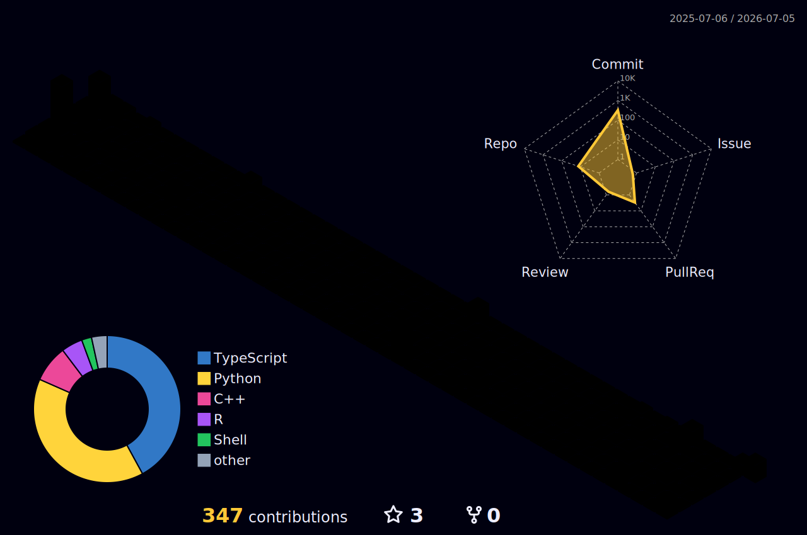

<div align="center">


<a href="https://www.linkedin.com/in/syedsameerfaisal">
  
</a>

<br/>

<a href="https://www.linkedin.com/in/syedsameerfaisal"></a>
<a href="mailto:syedsameerfaisal1@gmail.com"></a>
<a href="https://github.com/SyedSameerFaisall"></a>


</div>

<br/>

## 👋 About Me

I'm a **BSc Data Science student at UCL (ranked 1st in cohort)**, currently interning as a **Software Engineer at J.P. Morgan** on the Digital & Platform team within Investment Banking. I build things at the intersection of **machine learning, multi-agent AI systems, and quantitative finance** — from portfolio risk models to voice-to-dashboard emergency triage systems.

- 🔭 Currently building multi-agent AI workflows with **LangGraph, CrewAI, and AWS Bedrock**
- 📊 Focused on **statistical modeling, time-series forecasting (ARIMA/LSTM)**, and **portfolio risk (VaR)**
- 🎓 UCL Global Undergraduate Scholar · 5 A\* at A-Level (top 0.1% nationally)
- 🚀 CTO & Tech Lead @ **Simulatr** — an AI-powered simulation platform, concept → production
- 🏛️ VP @ **UCL Data Science Society** — scaled paid membership +200%, ran SQL workshops for 100+ students
- 💬 Ask me about: agentic AI pipelines, LLM orchestration, or financial time-series models

<br/>

## 🧰 Tech Stack

<div align="center">


</div>

<div align="center">


</div>

<br/>

## 🛠️ Notable Builds

| Project | What it does |
|---|---|
| **[Financial-Investment-Agent](https://github.com/SyedSameerFaisall/Financial-Investment-Agent)** | AI investment analyst evaluating stocks across valuation, technicals, analyst ratings & news sentiment |
| **[Brain-MRI-Classifier](https://github.com/SyedSameerFaisall/Brain-MRI-Classifier)** | CNN classifying brain MRI scans across four tumor categories — **96% test accuracy** |
| **[Book-Recommender-System](https://github.com/SyedSameerFaisall/Book-Recommender-System)** | Semantic book recommender using vector search + NLP on descriptions and emotional tone |
| **[NN-From-Scratch](https://github.com/SyedSameerFaisall/NN-From-Scratch)** | A from-scratch autograd engine and neural network library — backprop, no shortcuts |
| **[HEP-citation-analysis](https://github.com/SyedSameerFaisall/HEP-citation-analysis)** | Statistical analysis of arXiv High Energy Physics citation networks (1993–2001) |
| **[FareShare-Database](https://github.com/SyedSameerFaisall/FareShare-Database)** | Database tracking surplus food flow from suppliers to charities — hunger/waste/CO₂ impact |
| **Emergentica** | Real-time multi-agent voice-to-dashboard triage system — LangGraph + AWS Bedrock, **96.2% accuracy** at **sub-$0.15/call** |
| **CLAM** | Fully offline CLI assistant with inline suggestions & auto error-fixing — **<100ms** response via multi-tier caching |
| **Automated Insight Engine** | CrewAI + LangChain multi-agent system autonomously synthesizing insights from unstructured data |
| **Simulatr** | AI-powered simulation platform, concept → production — FastAPI, React, TypeScript, PostgreSQL, OAuth, Stripe |

<br/>

## 📊 GitHub Stats

<div align="center">


<br/>


<br/>



</div>

> These are live SVGs pulled from your real GitHub activity — they redraw automatically every time someone visits your profile, no maintenance needed. If a card ever shows as broken, it's almost always the hosted service hitting a temporary GitHub API rate limit — refreshing the page usually fixes it, and it's not something wrong with your profile.

<br/>

## 🎓 Education & Experience Snapshot

```
2024 – 2027   BSc Data Science, Statistical Science — University College London (Ranked 1st)
2023 – 2024   Computer Engineering / CS — Hong Kong University of Science & Technology
2021 – 2023   A-Levels (5A*) — Nixor College, Karachi

2026 – Now    Software Engineer Intern — J.P. Morgan (Digital & Platform, IB)
2025 – Now    MAPS Summer Research Intern — UCL Dept. of Mathematics (Learning Analytics)
2025 – Now    Vice President — UCL Data Science Society
2025 – Now    CTO & Tech Lead — Simulatr
```

<br/>

<div align="center">

### 📫 Let's connect — always up for talking AI agents, quant finance, or UCL data science

<a href="https://www.linkedin.com/in/syedsameerfaisal"></a>
<a href="mailto:syedsameerfaisal1@gmail.com"></a>

<br/>


</div>